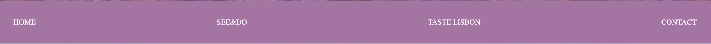
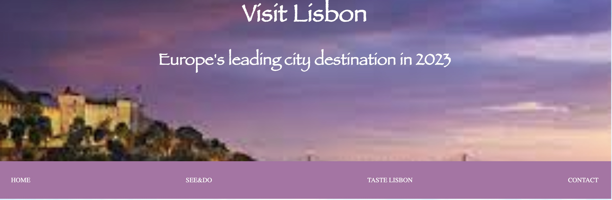
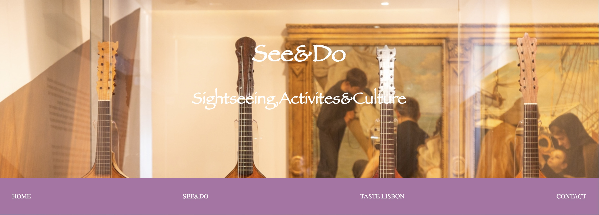
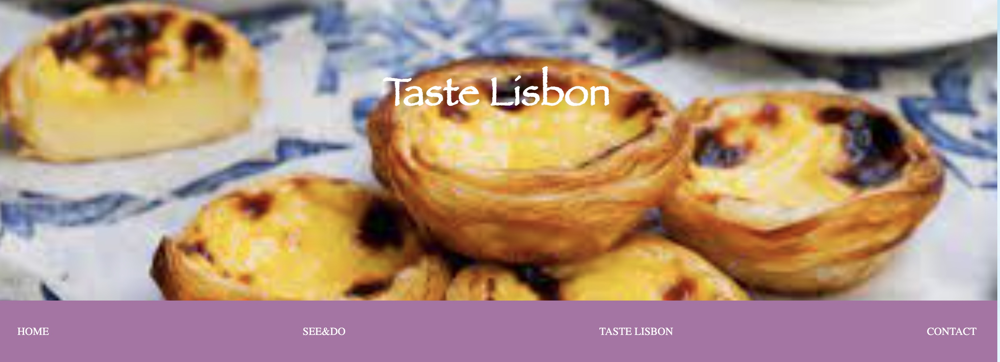
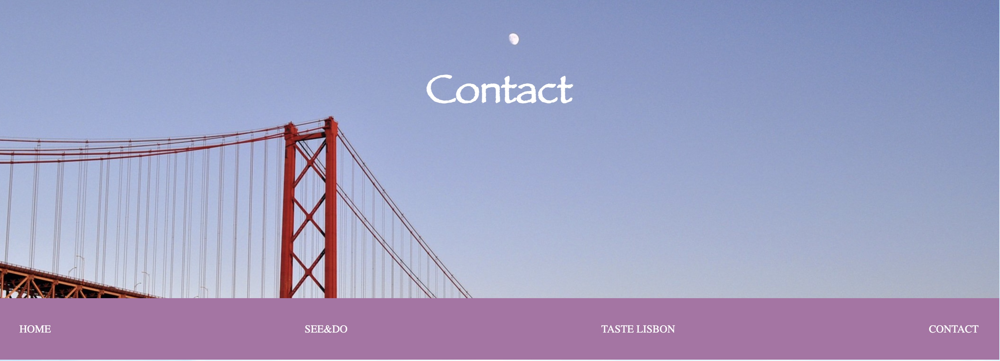

# Visit Lisbon

Visit Lisbon is a travel destination site which guides people keen to visit Lisbon city.
The aim of the site is to guide people through its main areas, attractions, sights, food and wine tasting. 
It also provides a contact page through which people can reach out and sign up to receive further information. 

There are also links to the social media platorms, an address, email address and phone number. 

![am i responsive]

[View visit Lisbon live project here] (https://github.com/Aaronharding10/Lisbon-destination-guide)
- - -

## Table of contents

### [User experience](#user-experience)

### [Features](#features)
* Existing features

### [Features Left to Implement](#features-left-to-implement)

### [Design](#design-1)

### [Technologies Used](#technologies-used)

### [Frameworks, Libraries & Programs Used](#frameworks-libraries--programs-used-)

### [Testing](#testing)
* [Validation Results]
* [Manual Testing]
* [Lighthouse Report]

### [Deployment and local development](#deployment-and-local-development)
* [GitHub Pages]
* [Forking the GitHub Repository]

### [Credits](#credits)

### [Acknowledgements](#acknowledgements)

---

## User Experience (UX)

This website is meant to attract people who are looking to visit and explore Lisbon City. 

There is a clear navigation detailing the main areas of lisbon, its main attractions and best food and wine to taste. 

Users can reach out to obtain further information about the city and the main elements to discover. 

## Design

* Colour scheme
 *Primary colours used on the website: ![colour scheme]

* Typography
 *Fantasy font and sens-serif are the 2 main fonts used throughout the site with the former mainy being used for headings and sub headings. 

 * Wireframes
  *Mainly a pen and notebook were used to structure the site. 

## Features

*This website is targeting people who would like to visit and explore Lisbon city. 
*When visiting the website they can view its main attractions, foods & drink and also reach out for further information via the "contact" page.
*Responsive on all devices.

### Existing Features

* Navigation bar
    * It is featured and fixed on all 4 pages.
    * It is identical in design and functionality between all 4 pages.
    * Allows easy navigation throughout the site.
    

* Main heading
    * Each page consists of a unique heading and backrgound image relevant to that page. 
    * The home page heading consists of a background image the Lisbon skyline at evening time and text of "Visit Lisbon". 
        *  The See&do page heading has a background image of the "Fado" instruments and "See & do" "Sightseeing, activies & culture".
        *  The Taste Lisbon page has a background image of the famous "Pasteis de nata" pastries and a heading of "Taste Lisbon".
        *  The contact page has a background image of the "25 the Abril bridge" and a heading of "Contact".
        

* Section one, Visit Lisbon
    * This section details the best areas of Lisbon to visit.
    * It also hightlights the reasons for visiting each area. 
   

   

* Section two, See & Do
    * This section lists the most famous attractions and sights and details the reason for visiting each. 
    * It also consists of a gallery below the attractions with supporting images to each which is valuable as it gives the user further insight to each attraction.

* Section three, Taste Lisbon
    * This section outlines the best places to visit for food and drink lovers and also the food and drink items unique to Lisbon.
    * There is also a gallery below to further guide and support the user. 
     

* Section four, Contact
    * The contact section allows the user to reach out for further information
    * It also lists the address, email address and phone number for the companyn for further information and support.

  

* Footer
    * Contact info such as Address, Email address and phone number.
    * Links to social media platforms such as Facebook, twitter and Instagram. 

## Features Left to Implement
   *Improved gallary with additional images.   

## Technologies Used

   * [HTML5](https://en.wikipedia.org/wiki/HTML5)
   * [CSS3](https://en.wikipedia.org/wiki/CSS)

## Frameworks, Libraries & Programs Used

 * [Gitpod](https://www.gitpod.io/)
      * To write the code.
 * [Git](https://git-scm.com/)
      * for vesion control.
 * [Github](https://github.com/)
      * Deployment of the website and storing the files online.
 * [Am I Responsive](https://ui.dev/amiresponsive)
      * Mockup picture for the README file.

## Testing

The W3C Markup Validator and W3C CSS Validator services were used to validate every page of the project to ensure there were no errors.

 * [W3C Markup Validtor](https://validator.w3.org/)
 * [W3C CSS Validator](https://jigsaw.w3.org/css-validator/)    

 ### Validation results

index.html

see&do.html

tastelisbon.html

contact.html

style.css

### Lighthouse Report

#### Mobile analysis

#### Desktop analysis

### GitHub Pages

### Forking the GitHub Repository

### Local Clone

## Credits

### Content

### Media 

## Acknowledgements

[def]: assets/images/contacthead.jpeg